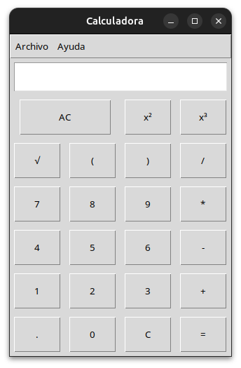

# Calculadora Gráfica con Python y Tkinter

Esta es una calculadora básica con interfaz gráfica desarrollada en **Python** utilizando la librería estándar **Tkinter**. El proyecto fue creado como parte de mi aprendizaje en el desarrollo de interfaces de usuario (GUI) y manejo de lógica de eventos.

## 🚀 Características
* Interfaz intuitiva y fácil de usar.
* Operaciones básicas: suma, resta, multiplicación y división.
* Soporte para operaciones complejas mediante el uso de paréntesis.
* Manejo de errores (evita cierres inesperados por entradas inválidas).
* Diseño responsivo mediante el gestor de geometría `grid`.

## ⌨️ Uso de Funciones Especiales
Para asegurar un cálculo correcto, ten en cuenta lo siguiente:
* **Raíz Cuadrada:** Al presionar `√`, se insertará `math.sqrt(`. Asegúrate de cerrar el paréntesis al final de tu número, por ejemplo: `math.sqrt(16)`.
* **Potencias:** Los botones `x²` y `x³` insertarán el operador de potencia de Python (`**2` y `**3`).

## 🛠️ Tecnologías utilizadas
* **Lenguaje:** Python 3.12.3
* **Librería GUI:** Tkinter
* **Control de Versiones:** Git & GitHub

## 📸 Captura de Pantalla



## 📦 Instalación y Uso

Para ejecutar esta calculadora localmente, asegúrate de tener Python instalado en tu sistema.

1. **Clonar el repositorio:**
   ```bash
   git clone [https://github.com/lautarogonzalez1405/Calculadora-grafica-Python.git](https://github.com/lautarogonzalez1405/Calculadora-grafica-Python.git)

2. **Navegar a la carpeta del proyecto:**
    ```bash
    cd Calculadora-grafica-Python

3. **Ejecutar la aplicación:**
    ```bash
    python3 calculadora.py


## 📝 Próximas Mejoras

* [ ] Implementar funciones cientificas (potencia, raiz cuadrada).
* [ ] Soporte para entrada de datos mediante el teclado fisico.
* [ ] Personalizacion de colores y temas (Modo oscuro).
* [ ] Historial de operaciones recientes.


## 👤 Autor

* Lautaro Gonzalez - lautarogonzalez1405